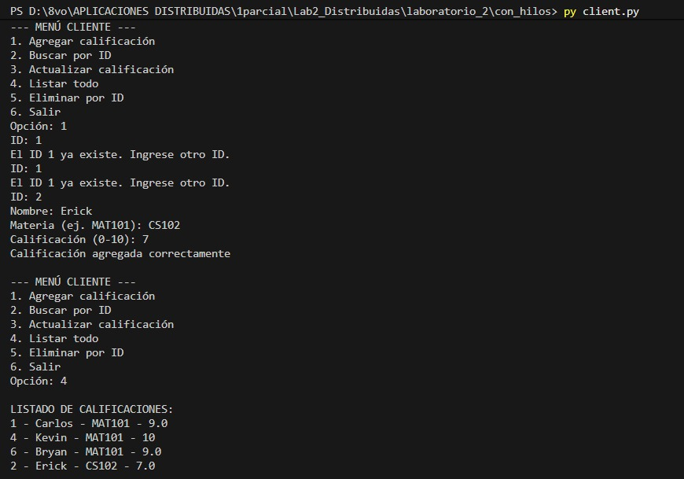
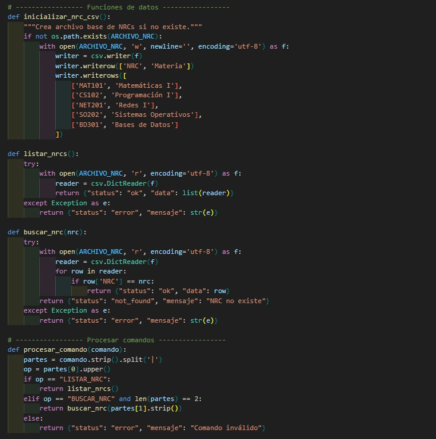
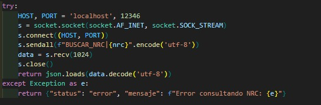
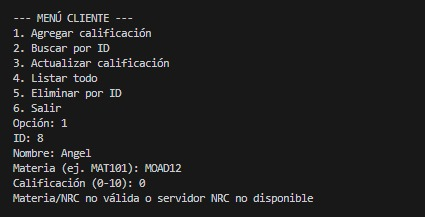
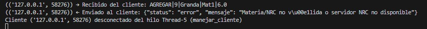

# Lab2_Distribuidas
Laboratiorio 2 de la materia de Aplicaciones Distribuidas 

INTEGRANTES:
BRYAN QUISPE 
CARLOS GRANDA
KEVIN COLOMA
ERICK MOREIRA

Durante el desarrollo del laboratorio se presentaron diversos desafíos, especialmente en la comunicación entre servidores mediante sockets, ya que fue necesario garantizar la sincronización y validación entre el servidor de calificaciones y el servidor NRC. Se implementaron mecanismos de manejo de errores y validación para mantener la integridad de los datos ante fallos o desconexiones. Además, se aplicaron conceptos del teorema CAP, priorizando la consistencia y disponibilidad del sistema frente a la partición de red. La estructura modular y el código comentado facilitaron la comprensión y mantenimiento del proyecto, mientras que la organización en directorios (sin_hilos y con_hilos) permitió distinguir claramente las etapas de evolución del sistema, desde su versión secuencial hasta la implementación concurrente con hilos.

PARTE 1 

Verificacion del servidor sin hilos


El servidor server.py en la carpeta con_hilos escucha en el puerto 12345 y atiende múltiples clientes simultáneamente mediante hilos.
Cada conexión genera un hilo independiente para manejar solicitudes concurrentes de búsqueda y listado.


Pruebas de menú

El archivo calificaciones.csv registra correctamente los datos enviados por los clientes, garantizando persistencia en disco.
Agregando un estudiante

Buscar y Enlistar estudiante


El servidor concurrente atiende múltiples conexiones simultáneas, generando un hilo independiente para cada cliente conectado.
Persistencia CSV

Pruebas de concurrencia

Se ejecutan varios clientes conectados simultáneamente al servidor, demostrando la atención paralela mediante hilos. Cada cliente realiza operaciones independientes como agregar, listar y actualizar calificaciones sin interferencias.


PARTE 2
Fragmento de código que implementa la creación, lectura y búsqueda de NRCs en el archivo CSV.
Permite validar materias y procesar comandos de tipo LISTAR_NRC y BUSCAR_NRC.

.

El cliente agrega calificaciones verificando NRCs válidos antes de registrarlos.
Se muestra el listado actualizado con múltiples estudiantes y sus calificaciones almacenadas.

.

Fragmento de la función agregar_calificacion() que verifica la respuesta del servidor NRC.
Previene el registro si la materia no existe o si el servidor NRC está fuera de servicio.

.

Función consultar_nrc() que establece conexión con el servidor NRC mediante sockets.
Permite validar la existencia de una materia antes de registrar la calificación en el servidor principal.

.

El cliente muestra un mensaje de validación al intentar registrar una materia inexistente o con el servidor NRC inactivo.
Demuestra tolerancia a fallos y control de errores en la comunicación distribuida.

.

El servidor muestra el log JSON de una solicitud fallida al intentar agregar una materia inválida.
Se evidencia el manejo de errores y la correcta respuesta enviada al cliente desde el hilo correspondiente.

.

## Análisis de Limitaciones en Concurrencia
En la implementación concurrente con hilos, se identifican posibles limitaciones como condiciones de carrera (race conditions) al acceder al archivo CSV compartido. Por ejemplo, si dos hilos intentan escribir simultáneamente (e.g., agregar calificaciones), podría ocurrir corrupción de datos o pérdida de registros. Para mitigar esto, se utiliza el módulo `csv` de Python, que no es thread-safe por defecto, pero en este caso, las operaciones de escritura se realizan de manera secuencial dentro de cada hilo, evitando conflictos directos. Sin embargo, en escenarios de alta concurrencia, se recomienda implementar locks (e.g., `threading.Lock`) para sincronizar accesos al archivo. Las pruebas realizadas demuestran que con pocos clientes (2-3), no se observan race conditions, pero en entornos de producción, esto podría escalar a problemas de rendimiento y consistencia.

## Expansión del Informe Reflexivo (Análisis y Documentación)
Además de los desafíos mencionados en la introducción, el teorema CAP se aplica priorizando consistencia (C) y disponibilidad (A) sobre partición (P), ya que el sistema rechaza operaciones inválidas (manteniendo consistencia) y maneja fallos de red sin detener el servicio (disponibilidad). Trade-offs incluyen latencia adicional en consultas NRC, pero se gana integridad de datos. Lecciones aprendidas: La modularidad facilita pruebas unitarias (e.g., funciones separadas para CRUD), y la estructura de directorios (sin_hilos vs. con_hilos) permite comparar versiones evolutivas, simplificando debugging y mantenimiento. El código comentado asegura legibilidad, como se ve en los archivos server.py y nrcs_server.py.

## Evidencia de Código Comentado
A continuación, fragmentos de código comentado para ilustrar la modularidad y documentación:

### Desde server.py (con hilos):
```python
def manejar_cliente(client_socket, addr):
    """
    Atiende a un cliente en un hilo independiente.
    - Recibe el comando del cliente
    - Procesa el comando
    - Envía la respuesta
    """
    hilo_actual = threading.current_thread().name
    print(f"[SERVER] 🟢 Cliente conectado desde {addr} en hilo {hilo_actual}")
    # ... resto del código
```

### Desde nrcs_server.py:
```python
def buscar_nrc(nrc):
    """
    Busca un NRC específico dentro del archivo CSV.
    Si existe, retorna un diccionario con los datos.
    Si no se encuentra, retorna un estado 'not_found'.
    """
    try:
        with open(ARCHIVO_NRC, 'r', encoding='utf-8') as f:
            reader = csv.DictReader(f)
            for row in reader:
                if row['NRC'] == nrc:
                    return {"status": "ok", "data": row}
        return {"status": "not_found", "mensaje": "NRC no existe"}
    except Exception as e:
        return {"status": "error", "mensaje": str(e)}
```
