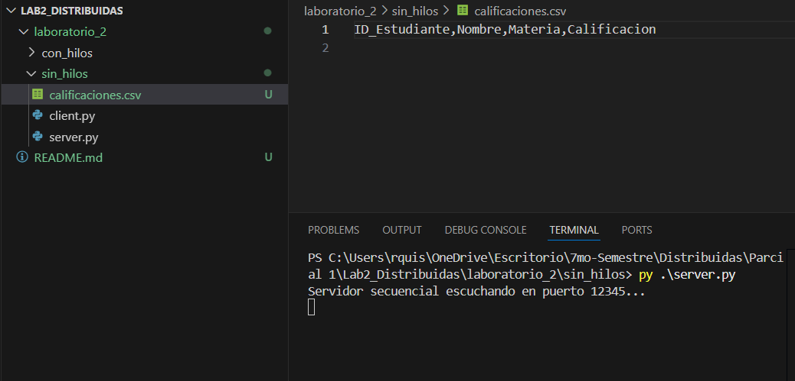
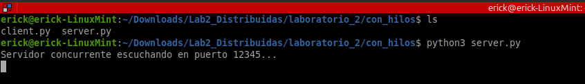
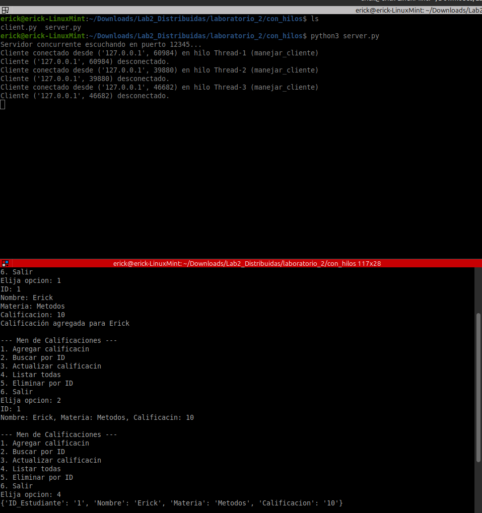
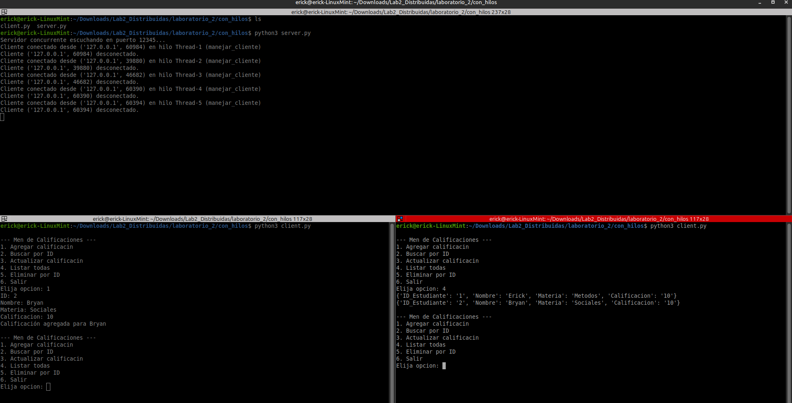
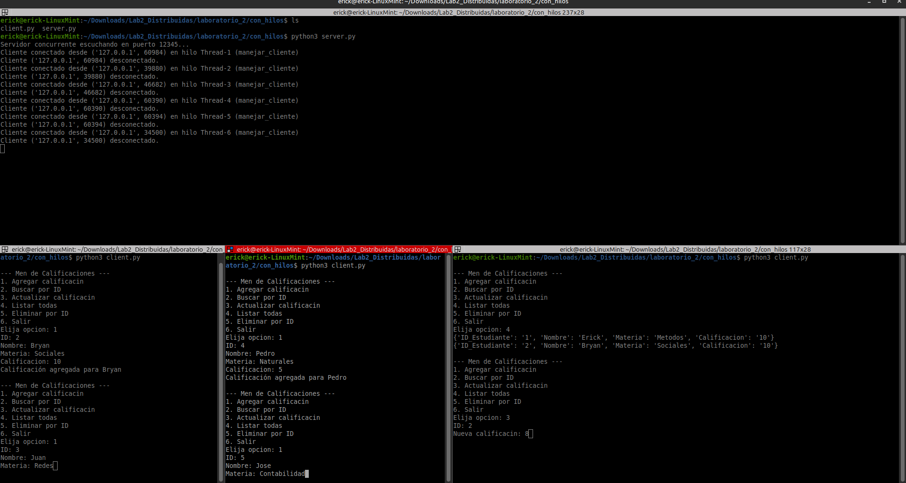

# Lab2_Distribuidas
Laboratiorio 2 de la materia de Aplicaciones Distribuidas 

INTEGRANTES:
BRYAN QUISPE 
CARLOS GRANDA
KEVIN COLOMA
ERICK MOREIRA

PARTE 1 

Verificacion del servidor sin hilos

Verificacion del servidor con hilos

Pruebas de menú
Agregando un estudiante

Buscar y Enlistar estudiante

Persistencia CSV

Pruebas de concurrencia
Dos clientes

Múltiples

