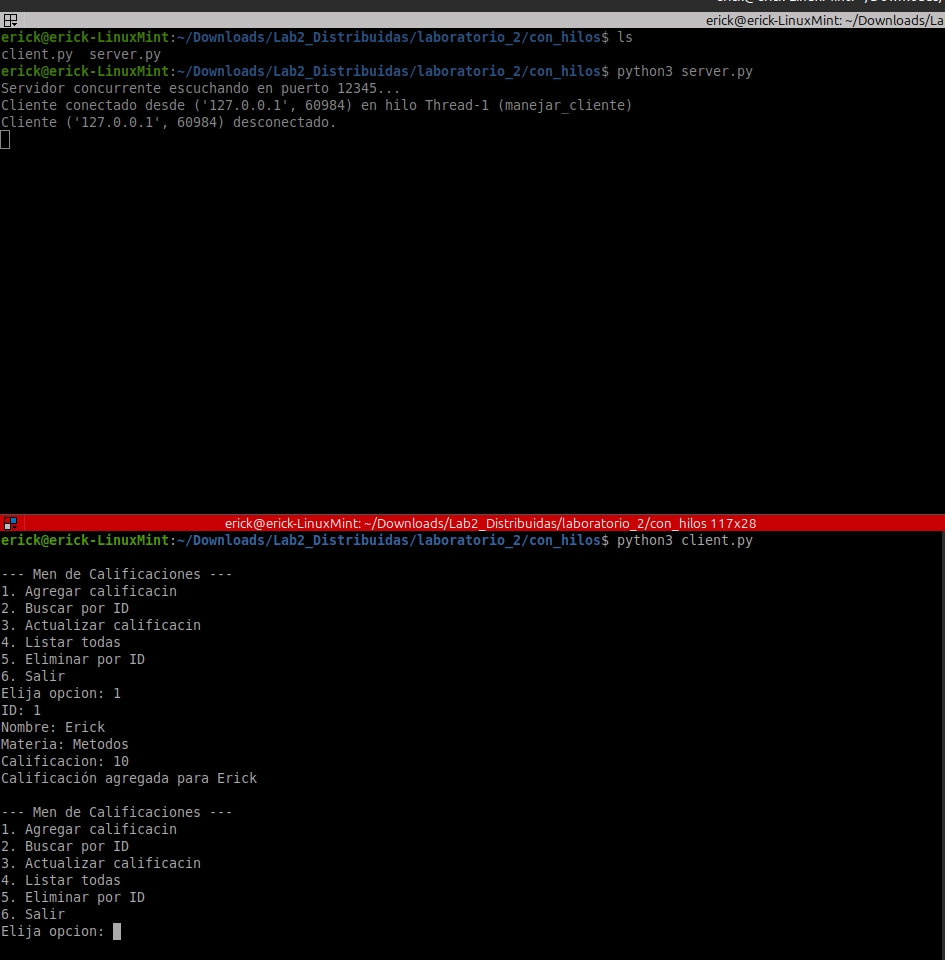

# Lab2_Distribuidas
Laboratiorio 2 de la materia de Aplicaciones Distribuidas 

INTEGRANTES:
BRYAN QUISPE 
CARLOS GRANDA
KEVIN COLOMA
ERICK MOREIRA

PARTE 1 

Verificacion del servidor sin hilos

El servidor server.py en la carpeta con_hilos escucha en el puerto 12345 y atiende múltiples clientes simultáneamente mediante hilos.
Cada conexión genera un hilo independiente para manejar solicitudes concurrentes de búsqueda y listado.

Pruebas de menú

El archivo calificaciones.csv registra correctamente los datos enviados por los clientes, garantizando persistencia en disco.
Agregando un estudiante

Buscar y Enlistar estudiante

El servidor concurrente atiende múltiples conexiones simultáneas, generando un hilo independiente para cada cliente conectado.
Persistencia CSV

Pruebas de concurrencia

Se ejecutan varios clientes conectados simultáneamente al servidor, demostrando la atención paralela mediante hilos. Cada cliente realiza operaciones independientes como agregar, listar y actualizar calificaciones sin interferencias.

PARTE 2
Fragmento de código que implementa la creación, lectura y búsqueda de NRCs en el archivo CSV.
Permite validar materias y procesar comandos de tipo LISTAR_NRC y BUSCAR_NRC.

.

El cliente agrega calificaciones verificando NRCs válidos antes de registrarlos.
Se muestra el listado actualizado con múltiples estudiantes y sus calificaciones almacenadas.

.

Fragmento de la función agregar_calificacion() que verifica la respuesta del servidor NRC.
Previene el registro si la materia no existe o si el servidor NRC está fuera de servicio.

.

Función consultar_nrc() que establece conexión con el servidor NRC mediante sockets.
Permite validar la existencia de una materia antes de registrar la calificación en el servidor principal.

.
